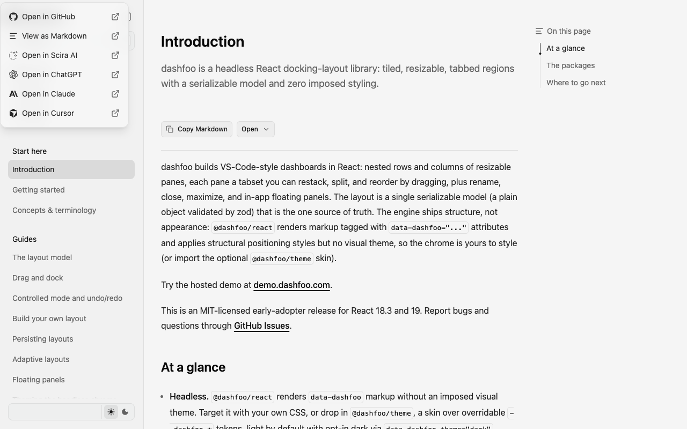
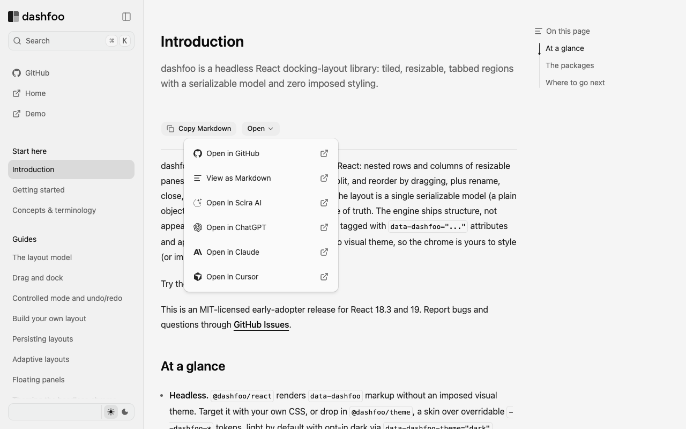
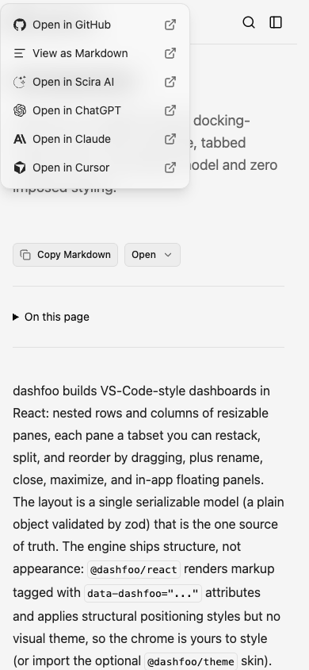
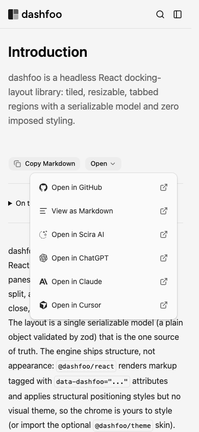

# shadcn visual comparison

Before: `c711233a7a5efa94667ce4fafd6b49f47236eb21` (PR merge base).

After UI source: `8d9d235ae8f48e3e2a5b9a92e7f53acd1a72bbc0`. Later commits in this PR only add review evidence.

The Open popover now anchors below its trigger instead of covering the viewport corner. Stock control sizes and menu spacing change; documentation content and branding remain.

Manually compared matching desktop (1280×800) and mobile (390×844) viewports in Chromium, light theme, reduced motion. No horizontal overflow or unexpected clipping was observed in the sampled after states. This covers the pages/states below, not every screen, authenticated flow, or dark-mode state.

## Introduction, Open popover expanded

App: `docs`. Route: `/`. Same route and state on both commits.

Desktop

| Before                                     | After                                    |
| ------------------------------------------ | ---------------------------------------- |
|  |  |

Mobile

| Before                                    | After                                   |
| ----------------------------------------- | --------------------------------------- |
|  |  |
